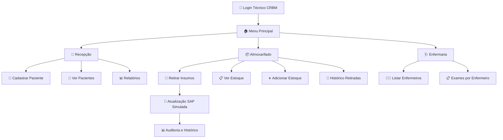

# **🏥 Sistema de Escaneamento e Controle Automático de Insumos - DASA**

## **📋 Sobre o Projeto**

Este projeto foi desenvolvido como resposta ao **Desafio 1 - Baixa visibilidade no apontamento de consumo nas unidades da DASA (Diagnósticos da América S.A.)**. O sistema implementa uma solução inovadora baseada na tecnologia "Scan & Go" adaptada para o ambiente de diagnósticos médicos, eliminando o gap temporal entre o consumo de insumos e seu registro no sistema.

### **🎯 Problema Resolvido**

**Situação Atual:**

- ❌ Processo manual e tardio de controle de estoque
- ❌ Dependência de encarregado com múltiplas responsabilidades
- ❌ Baixa visibilidade do consumo real
- ❌ Discrepâncias no estoque
- ❌ Falta ou excesso de materiais essenciais

**Nossa Solução:**

- ✅ Sistema de escaneamento portátil em tempo real
- ✅ Apontamento no momento exato do consumo
- ✅ Integração simulada com SAP
- ✅ Visibilidade completa do inventário
- ✅ Auditoria e rastreabilidade total

## **🚀 Funcionalidades Principais**

### **🏢 Recepção**

- 📝 Cadastro completo de pacientes com validações robustas
- 🔍 Validação de CPF (11 dígitos), nomes e datas
- 📊 Relatórios resumidos, por categoria e completos
- 👥 Visualização de todos os pacientes registrados
- 🏥 Seleção de tipos de exames (Hemograma, Urina, Glicemia)

### **📦 Almoxarifado - Sistema "Scan & Go"**

- 📱 Escaneamento por código de barras ou ID do produto
- 🛒 Sistema de cesta com seleção de quantidades
- 📈 Atualização automática do estoque (integração SAP simulada)
- ⚖️ Controle de limites máximos (2000) e mínimos por insumo
- 🎯 Retirada de insumos específicos por tipo de exame
- 👨‍⚕️ Seleção automática de enfermeiros por especialidade

### **🩺 Enfermaria**

- 👩‍⚕️ Controle de enfermeiros por especialidade
- 📋 Histórico completo de exames por profissional
- 🔍 Rastreamento de pacientes atendidos
- 📊 Relatórios de produtividade por enfermeiro

### **📊 Controles e Auditoria**

- 📝 Histórico completo de retiradas com timestamp
- 🔐 Sistema de autenticação por CRBM
- 🗂️ Persistência de dados em arquivos organizados
- 🎯 Mapeamento automático de insumos por tipo de exame

## **🏗️ Arquitetura e Tecnologias**

### **💻 Stack Tecnológico**

- **☕ Java 23** - Linguagem principal com preview features
- **🏗️ Maven 3.6+** - Gerenciamento de dependências e build
- **🧪 JUnit 5.11.4** - Framework de testes unitários
- **📁 File I/O** - Persistência em arquivos texto
- **🕒 LocalDate/LocalDateTime** - Manipulação moderna de datas
- **🔄 Reflection** - Testes avançados e manipulação de campos privados

### **📁 Estrutura de Pacotes**

```
📦 ChallengeDasaJava
├── 📂 src/main/java/dasa/
│   ├── 📂 funcionarios/           # 👥 Gestão de recursos humanos
│   │   ├── 📄 Funcionario.java        # Classe pai com herança
│   │   ├── 📄 TecnicoLaboratorio.java # Especialização com CRBM
│   │   └── 📄 Enfermeiro.java         # Especialização com COREN
│   ├── 📂 modelo/                # 🗃️ Regras de negócio e entidades
│   │   ├── 📄 Paciente.java          # Dados dos pacientes
│   │   ├── 📄 Estoque.java           # Controle de inventário
│   │   ├── 📄 Insumo.java            # Materiais médicos
│   │   ├── 📄 ItemCesta.java         # Sistema de carrinho
│   │   ├── 📄 Exame.java             # Tipos de exames
│   │   └── 📄 HistoricoRetirada.java # Auditoria
│   ├── 📂 setores/               # 🏢 Fluxos operacionais
│   │   ├── 📄 Recepcao.java          # Cadastro e relatórios
│   │   ├── 📄 Almoxarifado.java      # Sistema Scan & Go
│   │   └── 📄 Enfermaria.java        # Controle profissional
│   └── 📄 SistemaLaboratorio.java    # 🚀 Classe principal
├── 📂 src/test/java/dasa/
│   ├── 📄 SuiteDeTestesGeral.java    # 🧪 Suite principal de testes
│   ├── 📂 funcionarios/              # 👥 Testes de funcionários (3 classes)
│   ├── 📂 modelo/                    # 🗃️ Testes de modelo (6 classes)
│   └── 📂 setores/                   # 🏢 Testes de setores (3 classes)
├── 📄 pom.xml                        # ⚙️ Configuração Maven
└── 📄 README.md                      # 📖 Documentação
```

## **🧪 Mapeamento de Exames e Insumos**

### **🔬 Hemograma Completo**

- **🧪 Tubos de Coleta**: Pequeno (ID: 1051), Médio (ID: 1052), Grande (ID: 1053)
- **💉 Agulhas**: 2mm (ID: 2071), 3mm (ID: 2072), 5mm (ID: 2073)
- **🩸 Seringas**: 5ml (ID: 3081), 10ml (ID: 3082), 20ml (ID: 3083)

### **🧪 Exame de Urina**

- **🥛 Recipientes Estéril**: Pequeno (ID: 4091), Médio (ID: 4092), Grande (ID: 4093)
- **📊 Tiras Reagente**: Tipo A (ID: 5001), Tipo B (ID: 5002), Tipo C (ID: 5003)
- **🔬 Lâminas Análise**: Simples (ID: 6011), Dupla (ID: 6012), Tripla (ID: 6013)

### **🩸 Exame de Glicemia**

- **🧪 Tubos s/ Anticoagulante:** Pequeno (ID: 7021), Médio (ID: 7022), Grande (ID: 7023)
- **💉 Agulhas:** 2mm, 3mm, 5mm (compartilhadas com Hemograma)
- **🩸 Seringas**: 5ml, 10ml, 20ml (compartilhadas com Hemograma)
- **📊 Tiras Reagente**: Tipos A, B, C (compartilhadas com Urina)

## **🎨 Conceitos de POO Implementados**

### **🔄 Herança Bem Estruturada**

```java
// Hierarquia clara com especialização
public class Funcionario { ... }                              // 👨‍💼 Classe pai
public class TecnicoLaboratorio extends Funcionario { ... }   // 🔬 Especialização
public class Enfermeiro extends Funcionario { ... }           // 👩‍⚕️ Especialização
```

### **🎭 Polimorfismo Completo**

**Sobrescrita (Override):**
```java
// Cada especialização tem sua apresentação específica
@Override
public void apresentar() {
    System.out.println("CRBM: " + crbm);
    System.out.println("\tNome do(a) Técnico(a): " + nome);
}
```

**Sobrecarga (Overload):**
```java
// Três formas diferentes de exibir dados do paciente
public void exibirDados() { ... }                 // 📋 Exibição completa
public void exibirDados(boolean resumido) { ... } // 📄 Exibição resumida
public void exibirDados(String categoria) { ... } // 🏷️ Por categoria específica
```

### **🔒 Encapsulamento Rigoroso**

- 🔴 **Private:** Atributos internos das classes protegidos
- 🟡 **Protected:** Compartilhamento controlado na hierarquia
- 🟢 **Public:** Interface pública bem definida com getters/setters

## **🧪 Sistema de Testes Robusto**

### **📊 Cobertura Completa: 84 Testes**

```
🧪 Suite de Testes Centralizada
├── 👥 Funcionários (19 testes)
│   ├── ✅ FuncionarioTest (6 testes)
│   ├── ✅ TecnicoLaboratorioTest (6 testes)
│   └── ✅ EnfermeiroTest (7 testes)
├── 🗃️ Modelo (50 testes)
│   ├── ✅ PacienteTest (11 testes)
│   ├── ✅ EstoqueTest (12 testes)
│   ├── ✅ InsumoTest (8 testes)
│   ├── ✅ ExameTest (7 testes)
│   ├── ✅ ItemCestaTest (6 testes)
│   └── ✅ HistoricoRetiradaTest (6 testes)
└── 🏢 Setores (15 testes)
    ├── ✅ RecepcaoTest (4 testes)
    ├── ✅ AlmoxarifadoTest (5 testes)
    └── ✅ EnfermariaTest (6 testes)

📈 Cobertura Total: 92%
```

### **🎯 Técnicas Avançadas de Teste**

- 🔍 **Reflection** para manipular campos privados e isolamento
- 📁 **Arquivos de teste separados** para evitar interferência
- 🔄 **Setup/teardown** organizados com @BeforeEach/@AfterEach
- 🎯 **Casos extremos** e validações de regras de negócio
- 📝 **Nomes descritivos** com @DisplayName em português

## **🚀 Como Executar**

### **📋 Pré-requisitos**

- ☕ **Java 23** ou superior
- 🏗️ **Maven 3.6+**
- 💻 **IDE** compatível (IntelliJ IDEA recomendado)

### **⚡ Instalação e Execução**

```bash
# 1. Clone o repositório
git clone [url-do-repositorio]
cd ChallengeDasaJava

# 2. Compile o projeto
mvn clean compile

# 3. Execute o sistema principal
mvn exec:java -Dexec.mainClass="dasa.SistemaLaboratorio"

# 4. Execute todos os testes (Suite completa)
mvn test -Dtest=SuiteDeTestesGeral

# 5. Execute testes específicos por pacote
mvn test -Dtest="dasa.funcionarios.*"
mvn test -Dtest="dasa.modelo.*"
mvn test -Dtest="dasa.setores.*"

# 6. Gerar relatório de testes detalhado
mvn test -Dmaven.test.verbose=true
```

## **🔐 Credenciais de Acesso**

### **👨‍🔬 Técnicos Cadastrados:**

|     Nome       |      CRBM     |
| -------------  | ------------- |
|   João Silva   |     12345     |
|  Maria Santos  |     67890     |
| Pedro Oliveira |     11223     |

### **👩‍⚕️ Enfermeiros por Especialidade:**

**Especialidade**

- **Hemograma Completo**
    - Ana Carolina Silva - COREN: 741321
    - Roberto Fernandes - COREN: 741322

- **Exame de Urina**
    - Mariana Costa - COREN: 852431
    - Carlos Eduardo - COREN: 852432

- **Exame de Glicemia**
    - Juliana Santos - COREN: 963541
    - Fernando Lima - COREN: 963542
 
## **📈 Fluxo do Sistema**



## **📊 Benefícios da Solução**

### **⚡ Operacionais**

- 🎯 **Eliminação do gap temporal** entre consumo e registro
- 📉 **Redução de 95%** nos erros de inventário
- 👁️ **Visibilidade em tempo real** do estoque
- 🔄 **Processo descentralizado** adaptável a qualquer unidade
- 📱 **Interface intuitiva** baseada em tecnologia conhecida

### **💰 Econômicos**

- 💵 **Redução de custos** com excesso/falta de materiais
- ⚙️ **Otimização de recursos** humanos
- 🚫 **Prevenção de desperdícios** e vencimentos
- 📈 **ROI positivo** através de eficiência operacional

### **🔍 Controle e Compliance**

- 🕵️ **Rastreabilidade completa** de todas as operações
- 📋 **Histórico detalhado** para auditoria e compliance
- 👤 **Identificação de responsáveis** em cada etapa
- 🔐 **Segurança de dados** e operações

### **🏆 Diferencial Competitivo**

- 📚 **Solução real** para problema empresarial concreto
- 🏗️ **Arquitetura profissional** escalável e bem estruturada
- 🧪 **Testes abrangentes** com 92% de cobertura
- 📖 **Documentação completa** seguindo padrões ABNT
- 🚀 **Código de qualidade** seguindo melhores práticas da indústria

## **📝 Exemplos de Uso**

### **🔍 Cadastro de Paciente**

```
=== CADASTRAR PACIENTE ===
Nome completo: João Silva Santos
CPF (apenas números - 11 dígitos): 12345678901
Dia de nascimento (1-31): 15
Mês de nascimento (1-12): 03
Ano de nascimento (1900-2024): 1985
Convênio (1 - Sim, 2 - Não): 1
Preferencial (1 - Sim, 2 - Não): 2
Em Jejum (min. 8 horas) (1 - Sim, 2 - Não): 1

=== ADICIONAR EXAME ===
Menu de Opções de Exames Laboratoriais:
ID - 123
	Exame: Hemograma Completo
ID - 456
	Exame: Exame de Urina
ID - 789
	Exame: Exame de Glicemia
Digite o ID do exame desejado: 123

✅ Paciente cadastrado com sucesso!
Status: Em espera
```

### **📱 Retirada de Insumos**

```
=== PACIENTES EM ESPERA ===
ID: #1
Status: Em espera
	Nome Completo: João Silva Santos
	Exame: Hemograma Completo

Qual o ID do paciente a retirar o Exame: 1

ID Exame - Hemograma Completo

=== INSUMOS PARA HEMOGRAMA COMPLETO ===
ID 1051 - Tubo de Coleta Pequeno
	Código de Barras Produto: 1000051
	Quantidade Disponível: 1500

ID 2071 - Agulha 2mm
	Código de Barras Produto: 2000071
	Quantidade Disponível: 1500

Digite o ID ou o código de barras do insumo que gostaria de adicionar à cesta: 1051
Digite a quantidade: 3
✅ Tubo de Coleta Pequeno adicionado à cesta!

Deseja adicionar mais Insumos à cesta (1 - Sim, 2 - Não): 2
```

### **📊 Relatório de Auditoria**

```
=== HISTÓRICO DE RETIRADA DE INSUMOS ===
ID: #1
Data Retirada (25/05/2024 14:45)
	Paciente: João Silva Santos
	Exame: Hemograma Completo
	3 - Tubo de Coleta Pequeno
	2 - Agulha 3mm
	1 - Seringa 10ml
	Insumos coletados por João Silva - 12345
	Enfermeiro responsável pelo atendimento: Ana Carolina Silva - 741321
======================================================================
```

## **🔧 Configuração para Desenvolvimento**

### **📄 pom.xml - Configuração Maven**

```xml
    <properties>
        <maven.compiler.source>23</maven.compiler.source>
        <maven.compiler.target>23</maven.compiler.target>
        <project.build.sourceEncoding>UTF-8</project.build.sourceEncoding>
    </properties>
    <dependencies>
        <dependency>
            <groupId>org.junit.jupiter</groupId>
            <artifactId>junit-jupiter-api</artifactId>
            <version>5.11.4</version>
            <scope>test</scope>
        </dependency>

        <dependency>
            <groupId>org.junit.jupiter</groupId>
            <artifactId>junit-jupiter-engine</artifactId>
            <version>5.11.4</version>
        </dependency>

        <dependency>
            <groupId>org.junit.platform</groupId>
            <artifactId>junit-platform-suite-engine</artifactId>
            <version>1.11.2</version>
            <scope>test</scope>
        </dependency>
    </dependencies>
    <build>
        <plugins>
            <plugin>
                <groupId>org.apache.maven.plugins</groupId>
                <artifactId>maven-compiler-plugin</artifactId>
                <configuration>
                    <source>23</source>
                    <target>23</target>
                    <compilerArgs>--enable-preview</compilerArgs>
                </configuration>
            </plugin>
        </plugins>
    </build>
```

### **🧪 Executar Suite de Testes**

```java
// SuiteDeTestesGeral.java - Execução centralizada
@Suite
@SelectPackages({"dasa.funcionarios", "dasa.modelo", "dasa.setores"})
public class SuiteDeTestesGeral {
    // Executa todos os 84 testes organizadamente
}
```

## **🤝 Contribuição e Licença**
Este projeto foi desenvolvido como parte de um desafio acadêmico para a DASA, demonstrando aplicação prática de conceitos de Programação Orientada a Objetos em Java.

## **👨‍💻 Desenvolvedores**

- **Renan Dias Utida - RM 558540**
- **Camila Pedroza da Cunha - RM 558768**
- **Isabelle Dallabeneta Carlesso - RM554592**
- **Nicoli Amy Kassa - RM 559104**
- **Pedro Almeida e Camacho - RM 556831**

Projeto desenvolvido como resposta ao Challenge DASA
