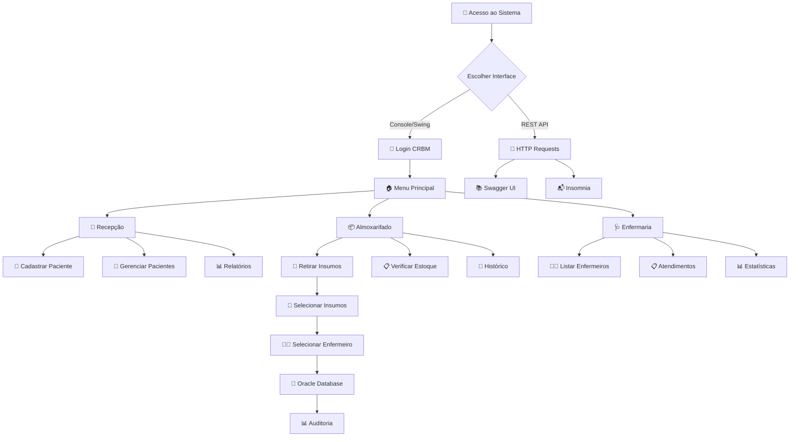

# **🏥 Sistema de Escaneamento e Controle Automático de Insumos (SECAI) - DASA**

## **📋 Índice**

- [Sobre o Projeto](#-sobre-o-projeto)
- [Arquitetura](#-arquitetura)
- [Tecnologias](#-tecnologias)
- [Funcionalidades Principais](#-funcionalidades-principais)
- [Mapeamento de Exames e Insumos](#-mapeamento-de-exames-e-insumos)
- [Estrutura do Projeto](#-estrutura-do-projeto)
- [Instalação e Configuração](#️-instalação-e-configuração)
- [Como Usar](#-como-usar)
- [API REST](#-api-rest)
- [Credenciais de Acesso](#-credenciais-de-acesso)
- [Fluxo do Sistema](#-fluxo-do-sistema)
- [Exemplos de Uso](#-exemplos-de-uso)
- [Banco de Dados](#️-banco-de-dados)
- [Sistema de Testes](#-sistema-de-testes)
- [Configuração para Desenvolvimento](#-configuração-para-desenvolvimento)
- [Documentação Técnica](#-documentação-técnica)
- [Métricas do Projeto](#-métricas-do-projeto)
- [Benefícios da Solução](#-benefícios-da-solução)
- [Equipe](#-equipe)

---

## **📋 Sobre o Projeto**

Sistema **completo de gestão laboratorial** desenvolvido para a **DASA (Diagnósticos da América S.A.)**, implementando solução inovadora baseada em tecnologia **"Scan & Go"** adaptada para diagnósticos médicos. O sistema elimina o gap temporal entre consumo de insumos e registro no sistema, oferecendo **controle de pacientes, atendimentos, estoque e gestão de profissionais de saúde**.

### **✨ Diferenciais**

- **🎨 Três interfaces completas:** Console, Swing GUI e REST API
- **🏗️ Arquitetura dual:** JDBC (Console/Swing) + JPA/Spring Boot (REST API)
- **📦 DTOs com validações:** Bean Validation + validadores customizados (@CPF, @PastDate)
- **🗄️ Banco de dados Oracle:** Com procedures, sequences e constraints
- **🧪 Sistema de testes robusto:** 221+ testes com JUnit 5
- **📚 Documentação Swagger:** OpenAPI 3.0 com interface interativa
- **🔄 Validações completas:** CPF, datas, nomes, estoque, exames
- **📊 Rastreabilidade total:** Histórico completo de operações com auditoria

### **🎯 Problema Resolvido**

**Situação Atual:**

- ❌ Processo manual e tardio de controle de estoque
- ❌ Dependência de encarregado com múltiplas responsabilidades
- ❌ Baixa visibilidade do consumo real
- ❌ Discrepâncias no estoque
- ❌ Falta ou excesso de materiais essenciais

**Nossa Solução:**

- ✅ Sistema de Escaneamento e Controle Automático de Insumos (SECAI)
- ✅ Apontamento no momento exato do consumo
- ✅ Integração simulada com SAP
- ✅ Visibilidade completa do inventário
- ✅ Auditoria e rastreabilidade total
- ✅ **API REST para integração com outros sistemas**

---

## **🏗️ Arquitetura**

```
┌──────────────────────────────────────────────────────────────┐
│                  CAMADA DE APRESENTAÇÃO                      │
├────────────────┬──────────────────┬──────────────────────────┤
│   Console UI   │     Swing GUI    │     REST API (Spring)    │
│                │                  │     + Swagger/OpenAPI    │
├────────────────┴──────────────────┴──────────────────────────┤
│        	         CAMADA DE DTOs                            │
│    	    PacienteRequestDTO | PacienteResponseDTO           │
│    	   AtendimentoRequestDTO | InsumoUpdateDTO             │
│        + Validadores Customizados (@CPF, @PastDate)          │
├──────────────────────────────────────────────────────────────┤
│                   CAMADA DE SERVIÇOS                         │
│    		  RecepcaoService | AlmoxarifadoService            │
│    		   EnfermariaService | EstoqueService              │
├──────────────────────────────────────────────────────────────┤
│             CAMADA DE ACESSO A DADOS (CONTROLLER)            │
│    		PacienteDao | AtendimentoDao | InsumoDao           │
│    		FuncionarioDao | HistoricoDao | ExameDao           │
│            		  +6 Implementações JDBC                   │
├──────────────────────────────────────────────────────────────┤
│                      CAMADA DE MODELO                        │
│           Paciente | Atendimento | Insumo | ItemCesta        │
│  		Exame | Funcionario | Enfermeiro | TecnicoLaboratorio  │
│    		+ Converters JPA (BooleanToSimNaoConverter)        │
├──────────────────────────────────────────────────────────────┤
│                	 CAMADA DE CONFIGURAÇÃO                    │
│    			 OracleConnectionFactory (JDBC)                │
│    			Spring Boot Configuration (JPA)                │
├──────────────────────────────────────────────────────────────┤
│                  	  BANCO DE DADOS ORACLE                    │
│              8 Tabelas + Sequences + Constraints             │
└──────────────────────────────────────────────────────────────┘
```

### **🔄 Arquitetura Dual: JDBC + JPA**

O projeto implementa uma **arquitetura híbrida inovadora:**

- **🖥️ Console/Swing:** Usam **JDBC puro** para máxima performance
- **🌐 REST API:** Usa **JPA/Hibernate** com Spring Boot para produtividade
- **🔄 Compatibilidade total:** Ambos acessam o mesmo banco Oracle
- **📦 Converters:** `BooleanToSimNaoConverter` para compatibilidade 'S'/'N'

---

## **💻 Tecnologias**

### **Core**
- **☕ Java 23** - Linguagem principal com preview features
- **🗄️ Oracle Database** - Persistência de dados
- **📦 Maven 3.6+** - Gerenciamento de dependências e build

### **Backend**
- **🌱 Spring Boot 3.3.5** - Framework REST API
- **🔌 JDBC** - Acesso direto ao banco (Console/Swing)
- **🗂️ JPA/Hibernate** - ORM para REST API
- **✅ Jakarta Validation** - Validações Bean Validation

### **Frontend/UI**
- **🖥️ Swing** - Interface gráfica desktop
- **📟 Console** - Interface em linha de comando

### **Documentação API**
- **📚 Swagger/OpenAPI 3.0** - Documentação interativa
- **📬 Insomnia Collection** - Collection pronta para testes

### **Testes**
- **🧪 JUnit 5.11.4** - Framework de testes unitários
- **🎭 Mockito 5.12.0** - Mocks para testes

### **Utilitários**
- **🏗️ Lombok** - Redução de boilerplate
- **🕒 LocalDate/LocalDateTime** - Manipulação moderna de datas

---

## **🚀 Funcionalidades Principais**

### **🏢 Recepção**
- 🧑‍⚕️ Cadastro completo de pacientes com validações robustas
- 🔍 Validação de CPF (11 dígitos), nomes e datas
- 🏥 Seleção de tipos de exames (Hemograma, Urina, Glicemia)
- 📝 Criação de atendimentos para exames
- 🔄 Gestão de status (Ativo/Inativo)
- 📊 Relatórios resumidos, por categoria e completos
- 🗂️ Histórico de exames por CPF
- ✏️ Correção e atualização de dados cadastrais

### **📦 Almoxarifado - Sistema "Scan & Go"**
- 🏥 Retirada de insumos por atendimento
  - 🎯 Mapeamento automático de insumos por tipo de exame
  - 📱 Escaneamento por código de barras ou ID do produto
  - 🛒 Sistema de cesta com seleção de quantidades
  - 📈 Atualização automática do estoque (integração SAP simulada)
  - 👨‍⚕️ Seleção automática de enfermeiros por especialidade
- ⚖️ Controle de estoque com limites máximos (2000) e mínimos
- 🤝 Associação automática insumo-exame
- 📜 Histórico completo de retiradas com timestamp
- 📊 Relatórios de estoque com status (Baixo/OK/Máximo)
- ⚠️ Alertas de estoque baixo

### **🩺 Enfermaria**
- 👩‍⚕️ Controle de enfermeiros por especialidade
- 📋 Histórico completo de exames por profissional
- 🔍 Rastreamento de atendimentos realizados
- 📊 Estatísticas de produtividade por enfermeiro
- 📈 Relatórios de atendimentos por período

### **🌐 REST API**
- 📡 **Endpoints RESTful** para integração com outros sistemas
- 📚 **Swagger UI** em `/swagger-ui` para documentação interativa
- ✅ **Validações automáticas** com Bean Validation
- 🔄 **DTOs** para Request/Response
- 🔐 **Validadores customizados:** @CPF e @PastDate
- 📬 **Collection Insomnia** pronta para testes

### **📊 Controles e Auditoria**
- 📝 Histórico completo de retiradas com timestamp
- 🔐 Sistema de autenticação por CRBM (Console/Swing)
- 🗂️ Persistência de dados no Oracle
- 🕵️ Rastreabilidade total de operações

---

## **🧪 Mapeamento de Exames e Insumos**

### **🔬 Hemograma Completo**

- **🧪 Tubos de Coleta**: Pequeno (ID: 1051), Médio (ID: 1052), Grande (ID: 1053)
- **💉 Agulhas**: 2mm (ID: 2071), 3mm (ID: 2072), 5mm (ID: 2073)
- **🩸 Seringas**: 5ml (ID: 3081), 10ml (ID: 3082), 20ml (ID: 3083)

### **🧪 Exame de Urina**

- **🥛 Recipientes Estéril**: Pequeno (ID: 4091), Médio (ID: 4092), Grande (ID: 4093)
- **📊 Tiras Reagente**: Tipo A (ID: 5001), Tipo B (ID: 5002), Tipo C (ID: 5003)
- **🔬 Lâminas Análise**: Simples (ID: 6011), Dupla (ID: 6012), Tripla (ID: 6013)

### **🩸 Exame de Glicemia**

- **🧪 Tubos s/ Anticoagulante:** Pequeno (ID: 7021), Médio (ID: 7022), Grande (ID: 7023)
- **💉 Agulhas:** 2mm, 3mm, 5mm (compartilhadas com Hemograma)
- **🩸 Seringas**: 5ml, 10ml, 20ml (compartilhadas com Hemograma)
- **📊 Tiras Reagente**: Tipos A, B, C (compartilhadas com Urina)

---

## **📁 Estrutura do Projeto**

```
📦 ChallengeDasaJava/
├── 📂 src/main/java/dasa/
│   ├── 📂 api/                                         # 🌐 REST API (Spring Boot)
│   │   ├── 📄 ApiApplication.java                      # Entry point Spring Boot
│   │   ├── 📄 ExameController.java                     # Controller de exames
│   │   ├── 📄 InsumoController.java                    # Controller de insumos
│   │   ├── 📄 OpenApiConfig.java                       # Config Swagger/OpenAPI
│   │   ├── 📄 PacienteController.java                  # Controller de pacientes
│   │   └── 📄 PingController.java                      # Health check endpoint
│   │
│   ├── 📂 config/										# ⚙️ Configurações do sistema
│   │   └── 📄 OracleConnectionFactory.java				# Factory para conexões JDBC/Oracle
│   │
│   ├── 📂 controller/									# 🎮 Camada de controle
│   │   ├── 📂 dao/										# Interfaces DAO
│   │   │   ├── 📄 AtendimentoDao.java					# Interface para atendimentos
│   │   │   ├── 📄 ExameDao.java						# Interface para exames
│   │   │   ├── 📄 FuncionarioDao.java					# Interface para funcionários
│   │   │   ├── 📄 HistoricoDao.java					# Interface para histórico
│   │   │   ├── 📄 InsumoDao.java						# Interface para insumos
│   │   │   └── 📄 PacienteDao.java						# Interface para pacientes
│   │   └── 📂 dao/jdbc/								# Implementações JDBC
│   │       ├── 📄 JdbcAtendimentoDao.java				# CRUD de atendimentos
│   │       ├── 📄 JdbcExameDao.java					# CRUD de exames
│   │       ├── 📄 JdbcFuncionarioDao.java				# CRUD de funcionários
│   │       ├── 📄 JdbcHistoricoRetiradaDao.java		# CRUD de histórico
│   │       ├── 📄 JdbcInsumoDao.java					# CRUD de insumos
│   │       └── 📄 JdbcPacienteDao.java					# CRUD de pacientes
│   │
│   ├── 📂 dto/                                         # 📦 Data Transfer Objects
│   │   ├── 📄 AtendimentoRequestDTO.java               # DTO para criar atendimento
│   │   ├── 📄 InsumoUpdateDTO.java                     # DTO para atualizar insumo
│   │   ├── 📄 PacienteRequestDTO.java                  # DTO para criar/atualizar paciente
│   │   ├── 📄 PacienteResponseDTO.java                 # DTO de resposta paciente
│   │   └── 📂 validation/                              # Validadores customizados
│   │       ├── 📄 CPF.java                             # Anotação @CPF
│   │       ├── 📄 CPFValidator.java                    # Validador de CPF
│   │       ├── 📄 PastDate.java                        # Anotação @PastDate
│   │       └── 📄 PastDateValidator.java               # Validador de data passada
│   │
│   ├── 📂 model/                                       # 📊 Camada de modelo
│   │   ├── 📂 converters/                              # Converters JPA
│   │   │   └── 📄 BooleanToSimNaoConverter.java        # Converte Boolean ↔ 'S'/'N'
│   │   ├── 📂 domain/                                  # Entidades de domínio
│   │   │   ├── 📄 Atendimento.java                     # @Entity com JPA + JDBC
│   │   │   ├── 📄 Exame.java                           # @Entity com JPA + JDBC
│   │   │   ├── 📄 Insumo.java                          # @Entity com JPA + JDBC
│   │   │   ├── 📄 ItemCesta.java                       # Classe auxiliar (não @Entity)
│   │   │   └── 📄 Paciente.java                        # @Entity com JPA + JDBC
│   │   └── 📂 funcionarios/                            # Hierarquia de funcionários
│   │       ├── 📄 Enfermeiro.java                      # @Entity extends Funcionario
│   │       ├── 📄 Funcionario.java                     # @MappedSuperclass abstrata
│   │       └── 📄 TecnicoLaboratorio.java              # @Entity extends Funcionario
│   │
│   ├── 📂 service/ 									# 🛠️ Camada de serviços
│   │   ├── 📄 AlmoxarifadoService.java					# Lógica do almoxarifado
│   │   ├── 📄 EnfermariaService.java					# Lógica da enfermaria
│   │   ├── 📄 EstoqueService.java						# Controle de estoque
│   │   └── 📄 RecepcaoService.java						# Lógica da recepção
│   │
│   └── 📂 view/										# 👁️ Camada de apresentação
│       └── 📂 ui/
│           ├── 📂 console/								# Interface console
│           │   ├── 📄 ConsoleMain.java					# Entry point console
│           │   └── 📂 setores/
│           │       ├── 📄 ConsoleAlmoxarifado.java		# UI almoxarifado
│           │       ├── 📄 ConsoleEnfermaria.java		# UI enfermaria
│           │       └── 📄 ConsoleRecepcao.java			# UI recepção
│           └── 📂 swing/								# Interface gráfica
│               ├── 📄 SwingMain.java					# Entry point GUI
│               └── 📂 setores/
│                   ├── 📄 SwingAlmoxarifado.java		# GUI almoxarifado
│                   ├── 📄 SwingEnfermaria.java			# GUI enfermaria
│                   └── 📄 SwingRecepcao.java			# GUI recepção
│
├── 📂 resources			                            # ⚙️ Recursos da aplicação
│   ├── 📄 application.properties                       # Config Spring Boot
│   ├── 📄 application-dev.properties                   # Perfil desenvolvimento (H2)
│   └── 📄 application-prod.properties                  # Perfil produção (Oracle)
│   
│
├── 📂 sql/												# 🗄️ Scripts do banco
│   ├── 📄 schema.sql									# Estrutura das tabelas
│   ├── 📄 carga_inicial.sql							# Dados iniciais
│   └── 📄 verificacao.sql								# Verificação do banco
│
├── 📂 src/test/java/com/dasa/                         # 🧪 Testes unitários
│   ├── 📄 SuiteDeTestesGeral.java                     # Suite principal
│   ├── 📂 api/                                        # Testes dos Controllers REST
│   │   ├── 📄 ExameControllerTest.java
│   │   ├── 📄 InsumoControllerTest.java
│   │   ├── 📄 PacienteControllerTest.java
│   │   └── 📄 PingControllerTest.java
│   ├── 📂 config/                                     # Testes de configuração
│   │   └── 📄 OracleConnectionFactoryTest.java
│   ├── 📂 controller/dao/jdbc/                        # Testes dos DAOs
│   │   ├── 📄 JdbcAtendimentoDaoTest.java
│   │   ├── 📄 JdbcExameDaoTest.java
│   │   ├── 📄 JdbcFuncionarioDaoTest.java
│   │   ├── 📄 JdbcHistoricoRetiradaDaoTest.java
│   │   ├── 📄 JdbcInsumoDaoTest.java
│   │   └── 📄 JdbcPacienteDaoTest.java
│   ├── 📂 dto/                                        # Testes dos DTOs
│   │   ├── 📄 AtendimentoRequestDTOTest.java
│   │   ├── 📄 InsumoUpdateDTOTest.java
│   │   ├── 📄 PacienteRequestDTOTest.java
│   │   ├── 📄 PacienteResponseDTOTest.java
│   │   └── 📂 validation/                             # Testes dos validadores
│   │       ├── 📄 CPFValidatorTest.java
│   │       └── 📄 PastDateValidatorTest.java
│   ├── 📂 model/                                      # Testes do modelo
│   │   ├── 📂 converters/
│   │   │   └── 📄 BooleanToSimNaoConverterTest.java
│   │   ├── 📂 domain/
│   │   │   ├── 📄 AtendimentoTest.java
│   │   │   ├── 📄 ExameTest.java
│   │   │   ├── 📄 InsumoTest.java
│   │   │   ├── 📄 ItemCestaTest.java
│   │   │   └── 📄 PacienteTest.java
│   │   └── 📂 funcionarios/
│   │       ├── 📄 EnfermeiroTest.java
│   │       ├── 📄 FuncionarioTest.java
│   │       └── 📄 TecnicoLaboratorioTest.java
│   └── 📂 service/                                    # Testes dos serviços
│       ├── 📄 AlmoxarifadoServiceTest.java
│       ├── 📄 EnfermariaServiceTest.java
│       ├── 📄 EstoqueServiceTest.java
│       └── 📄 RecepcaoServiceTest.java
│
├── 📄 insomnia-challenge-dasa-java.json       			# Collection Insomnia
├── 📄 README.md										# 📖 Documentação
└── 📄 pom.xml											# ⚙️ Configuração Maven                     
```

---

## **⚙️ Instalação e Configuração**

### **📋 Pré-requisitos**

- ☕ **Java 23** ou superior
- 🗄️ **Oracle Database** (11g+)
- 🏗️ **Maven 3.6+**
- 💻 **IDE compatível** (IntelliJ IDEA, Eclipse ou VS Code)
- 📬 **Insomnia** (opcional, para testar API REST)

### **⚡ Configuração do Ambiente**

#### **1️⃣ Clone o repositório**
```bash
git clone [url-do-repositorio]
cd ChallengeDasaJava
```

#### **2️⃣ Configure o banco de dados Oracle**
Execute os scripts SQL no Oracle SQL Developer **na ordem:**
```sql
-- 1. Criar estrutura (tabelas, sequences, constraints)
@sql/schema.sql

-- 2. Carregar dados iniciais (pacientes, exames, insumos, funcionários)
@sql/carga_inicial.sql

-- 3. Verificar instalação
@sql/verificacao.sql
```

#### **3️⃣ Configure as credenciais**

**Para Console/Swing (JDBC):**
Edite `src/main/java/com/dasa/config/OracleConnectionFactory.java`:
```java
String url  = "jdbc:oracle:thin:@localhost:1521:xe";
String user = "SEU_USUARIO";
String pass = "SUA_SENHA";
```

**Para REST API (Spring Boot):**
Edite `src/main/resources/application-prod.properties`:
```properties
spring.datasource.url=jdbc:oracle:thin:@localhost:1521:orcl
spring.datasource.username=SEU_USUARIO
spring.datasource.password=SUA_SENHA
```

#### **4️⃣ Compile o projeto**
```bash
mvn clean install
```

---

## **🎮 Como Usar**

### **🖥️ Interface Console**
```bash
mvn exec:java -Dexec.mainClass="com.dasa.view.ui.console.ConsoleMain"
```

### **🎨 Interface Swing (GUI)**
```bash
mvn exec:java -Dexec.mainClass="com.dasa.view.ui.swing.SwingMain"
```

### **🌐 REST API (Spring Boot)**
```bash
mvn spring-boot:run
```

Acesse:
- **API Base:** http://localhost:8080
- **Swagger UI:** http://localhost:8080/swagger-ui
- **Health Check:** http://localhost:8080/api/ping

---

## **🌐 API REST**

### **📡 Endpoints Disponíveis**

#### **🧑‍⚕️ Pacientes** (`/api/pacientes`)

| Método | Endpoint | Descrição |
|--------|----------|-----------|
| GET | `/api/pacientes` | Listar todos os pacientes |
| GET | `/api/pacientes/{id}` | Buscar paciente por ID |
| GET | `/api/pacientes/cpf/{cpf}` | Buscar paciente por CPF |
| POST | `/api/pacientes` | Criar novo paciente |
| PUT | `/api/pacientes/{id}` | Atualizar paciente |
| DELETE | `/api/pacientes/{id}` | Excluir paciente |

#### **💉 Insumos** (`/api/insumos`)

| Método | Endpoint | Descrição |
|--------|----------|-----------|
| GET | `/api/insumos` | Listar todos os insumos |
| GET | `/api/insumos/{id}` | Buscar insumo por ID |
| GET | `/api/insumos/codigo/{codigo}` | Buscar por código de barras |
| GET | `/api/insumos/tipo/{tipo}` | Listar por tipo |
| GET | `/api/insumos/exame/{exame}` | Listar por exame |
| PUT | `/api/insumos/{id}/quantidade` | Atualizar quantidade |
| POST | `/api/insumos/{id}/adicionar` | Adicionar ao estoque |
| POST | `/api/insumos/{id}/remover` | Remover do estoque |

#### **🔬 Exames** (`/api/exames`)

| Método | Endpoint | Descrição |
|--------|----------|-----------|
| GET | `/api/exames` | Listar todos os exames |
| GET | `/api/exames/{id}` | Buscar exame por ID |
| GET | `/api/exames/nome/{nome}` | Buscar por nome |

### **📚 Documentação Interativa**

Acesse o **Swagger UI** em: http://localhost:8080/swagger-ui

### **📬 Collection Insomnia**

Importe a collection em `src/main/resources/insomnia-challenge-dasa-java.json`:

1. Abra o **Insomnia**
2. Clique em **Import/Export** → **Import Data**
3. Selecione **From File**
4. Escolha o arquivo `insomnia-challenge-dasa-java.json`
5. Pronto! 17 endpoints prontos para testar

### **✅ Validações Automáticas**

A API implementa validações robustas com **Bean Validation**:

#### **PacienteRequestDTO**
```java
{
  "nomeCompleto": "João Silva",           // @NotBlank, @Size(3-120), @Pattern(apenas letras)
  "cpf": "123.456.789-01",                // @NotBlank, @CPF (validação customizada)
  "dataNascimento": "15/03/1990",         // @NotBlank, @Pattern(dd/MM/yyyy), @PastDate
  "convenio": true,                       // @NotNull
  "preferencial": false                   // @NotNull
}
```

#### **Validadores Customizados**

**@CPF** - Valida CPF:
- ✅ Remove formatação automaticamente
- ✅ Verifica 11 dígitos
- ✅ Rejeita sequências repetidas (111.111.111-11)

**@PastDate** - Valida data no passado:
- ✅ Formato dd/MM/yyyy
- ✅ Data anterior a hoje
- ✅ Ano entre 1900 e atual

---

## **🔐 Credenciais de Acesso**

### **👨‍🔬 Técnicos de Laboratório Cadastrados:**

|     Nome       |      CRBM     |
| -------------  | ------------- |
|   João Silva   |     12345     |
|  Maria Santos  |     67890     |
| Pedro Oliveira |     11223     |

### **👩‍⚕️ Enfermeiros por Especialidade:**

**Especialidade**

- **Hemograma Completo**
    - Ana Carolina Silva - COREN: 741321
    - Roberto Fernandes - COREN: 741322

- **Exame de Urina**
    - Mariana Costa - COREN: 852431
    - Carlos Eduardo - COREN: 852432

- **Exame de Glicemia**
    - Juliana Santos - COREN: 963541
    - Fernando Lima - COREN: 963542

---

## **📈 Fluxo do Sistema**



---

## **📝 Exemplos de Uso**

### **🔍 Cadastro de Paciente - Recepção (Console)**

```
=== RECEPÇÃO ===
1 - Cadastrar Paciente/Atendimento
2 - Relatório de Atendimentos
3 - Relatório de Pacientes
4 - Histórico de Exames por Paciente
5 - Gerenciar Pacientes
6 - Voltar
Opção: 1

=== CADASTRAR ===
1 - Cadastrar Novo Paciente
2 - Cadastrar Atendimento para Paciente Existente
3 - Voltar
Opção: 1

=== CADASTRAR NOVO PACIENTE ===
Nome completo: Leandro Santos
CPF (apenas números - 11 dígitos): 12345678909
Dia de nascimento (1-31): 15
Mês de nascimento (1-12): 03
Ano de nascimento (1900-2024): 1990
Convênio (1 - Sim, 2 - Não): 1
Preferencial (1 - Sim, 2 - Não): 2
Em Jejum (min. 8 horas) (1 - Sim, 2 - Não): 1

=== ADICIONAR EXAME ===
Menu de Opções de Exames Laboratoriais:
ID - 123
	Exame: Hemograma Completo
ID - 456
	Exame: Exame de Urina
ID - 789
	Exame: Exame de Glicemia
Digite o ID do exame desejado: 123

✅ Paciente e atendimento cadastrados com sucesso!
ID do Atendimento: #10
Status: Em espera
```

### **📱 Retirada de Insumos - Almoxarifado (Console)**

```
=== ALMOXARIFADO ===
1 - Retirar insumos para exame
2 - Verificar histórico de retirada
3 - Verificar Estoque
4 - Adicionar Estoque
5 - Voltar
Opção: 1

=== ATENDIMENTOS EM ESPERA ===
ID Atendimento: #10
Status: Em espera
	Paciente: Leandro Santos
	CPF: 123.456.789-09
	Data Nascimento: 15/03/1990
	Convênio: Sim
	Preferencial: Não
	Exame: Hemograma Completo
	Jejum (min. 8 horas): Sim
	Data do Exame: 21/09/2025 03:11
	Enfermeiro Responsável: Em espera
	Responsável Coleta de Insumos: Em espera
========================================================
ID do atendimento a processar: 10

Exame: Hemograma Completo

=== INSUMOS PARA HEMOGRAMA COMPLETO ===
...
ID Insumo: 3081 - Nome Insumo: Seringa 5ml
	Código de Barras Produto: 3000081
	Quantidade Disponível: 1500
	Quantidade Máxima: 2000
=============================================================
...

Digite o ID ou código de barras do insumo: 3081
Digite a Quantidade: 3
✅ 3x Seringa 5ml adicionado à cesta!
Deseja adicionar mais Insumos à cesta (1 - Sim, 2 - Não): 2

=== ENFERMEIROS DISPONÍVEIS ===
COREN: 741321
	Nome do(a) Enfermeiro(a): Ana Carolina Silva
	Especialidade: Hemograma Completo

COREN: 741322
	Nome do(a) Enfermeiro(a): Roberto Fernandes
	Especialidade: Hemograma Completo

Digite COREN do enfermeiro responsável: 741321

✅ Retirada processada com sucesso para exame Hemograma Completo!
3 - Seringa 5ml
Insumos coletados por João Silva
Enfermeiro responsável pelo atendimento: Ana Carolina Silva - 741321
Disponibilidade de insumos atualizadas no SAP
```

### **📊 Relatório de Histórico - Almoxarifado (Console)**

```
=== ALMOXARIFADO ===
1 - Retirar insumos para exame
2 - Verificar histórico de retirada
3 - Verificar Estoque
4 - Adicionar Estoque
5 - Voltar
Opção: 2

=== HISTÓRICO DE RETIRADA DE INSUMOS ===
ID Atendimento: #5
Data Retirada (20/09/2025 13:29)
	Paciente: Guilherme Teixeira
	Exame: Exame de Glicemia
	1 - Agulha 3mm
	2 - Seringa 10ml
	1 - Tira Reagente Tipo A
	1 - Tira Reagente Tipo B
	1 - Tira Reagente Tipo C
	1 - Tubo sem Anticoagulante Grande
	2 - Tubo sem Anticoagulante Médio
	1 - Tubo sem Anticoagulante Pequeno
	Insumos coletados por Maria Santos - 67890
	Enfermeiro responsável pelo atendimento: Fernando Lima - 963542
========================================
ID Atendimento: #10
Data Retirada (21/09/2025 03:14)
	Paciente: Leandro Santos
	Exame: Hemograma Completo
	3 - Seringa 5ml
	Insumos coletados por João Silva - 12345
	Enfermeiro responsável pelo atendimento: Ana Carolina Silva - 741321
========================================
```

### 🩺 **Exames feitos por Enfermeiro Específico**

```
=== ENFERMARIA ===
1 - Listar todos os Enfermeiros
2 - Exames feitos por enfermeiro específico
3 - Estatísticas de atendimento
4 - Voltar
Opção: 2

=== ENFERMEIROS QUE JÁ ATENDERAM ===
COREN: 741321
	Nome do(a) Enfermeiro(a): Ana Carolina Silva
	Especialidade: Hemograma Completo
	Total de atendimentos: 2

COREN: 741322
	Nome do(a) Enfermeiro(a): Roberto Fernandes
	Especialidade: Hemograma Completo
	Total de atendimentos: 1

Digite o COREN do enfermeiro: 741321

=== ATENDIMENTOS REALIZADOS ===
ID Atendimento: #10
Status: Atendido
	Paciente: Leandro Santos
	CPF: 123.456.789-09
	Data Nascimento: 15/03/1990
	Convênio: Sim
	Preferencial: Não
	Exame: Hemograma Completo
	Jejum (min. 8 horas): Sim
	Data do Exame: 21/09/2025 03:11
	Enfermeiro Responsável: Ana Carolina Silva - COREN: 741321
	Responsável Coleta de Insumos: João Silva - CRBM: 12345
========================================================
ID Atendimento: #1
Status: Atendido
	Paciente: Bruna Gradfield
	CPF: 123.456.789-00
	Data Nascimento: 12/08/2005
	Convênio: Não
	Preferencial: Não
	Exame: Hemograma Completo
	Jejum (min. 8 horas): Sim
	Data do Exame: 20/09/2025 13:06
	Enfermeiro Responsável: Ana Carolina Silva - COREN: 741321
	Responsável Coleta de Insumos: Maria Santos - CRBM: 67890
========================================================
```

---

## **🖥️ Interface Swing**

A interface gráfica (GUI) oferece as mesmas funcionalidades com uma experiência visual moderna:

- Login com validação de CRBM
- Menu principal com navegação intuitiva
- Formulários com validação em tempo real
- Tabelas interativas para visualização de dados
- Relatórios exportáveis
- Alertas visuais para estoque baixo

### 🔐 **Login**


### 🏠 **Menu Inicial**


### 🛎️ **Recepção**


### 📦 **Almoxarifado**


### 🏥 **Enfermaria**


---

## **🌐 API REST**

### **🌐 API REST - Criar Paciente**
```bash
# Request
POST http://localhost:8080/api/pacientes
Content-Type: application/json

{
  "nomeCompleto": "Carlos Eduardo Silva",
  "cpf": "98765432100",
  "dataNascimento": "20/05/1985",
  "convenio": true,
  "preferencial": false
}

# Response (201 Created)
{
  "id": 15,
  "nomeCompleto": "Carlos Eduardo Silva",
  "cpfFormatado": "987.654.321-00",
  "dataNascimento": "20/05/1985",
  "convenio": true,
  "preferencial": false,
  "statusPaciente": "Ativo"
}
```

### **📊 API REST - Atualizar Estoque**
```bash
# Adicionar 50 unidades
POST http://localhost:8080/api/insumos/3081/adicionar?quantidade=50

# Response
{
  "id": 3081,
  "adicionado": 50,
  "quantidadeAtual": 1550,
  "nome": "Seringa 5ml"
}
```

---

## **🗄️ Banco de Dados**

### **📊 Oracle Database - 8 Tabelas**

#### **Estrutura Completa:**

- **dasa_pacientes:** Dados cadastrais dos pacientes
- **dasa_atendimentos:** Registro de atendimentos/exames
- **dasa_insumos:** Controle de estoque de materiais
- **dasa_historico_retiradas:** Auditoria de retiradas
- **dasa_itens_retirada:** Detalhes dos itens retirados
- **dasa_enfermeiros:** Profissionais por especialidade
- **dasa_tecnicos:** Técnicos de laboratório
- **dasa_exames:** Tipos de exames disponíveis

#### **Sequences:**
- `seq_paciente_id`
- `seq_atendimento_id`

#### **Constraints:**
- **Primary Keys** em todas as tabelas
- **Foreign Keys** para integridade referencial
- **Unique** em CPF, COREN, CRBM
- **Check** para status e validações

---

## **🧪 Sistema de Testes**

### **📊 Cobertura Total: 221+ Testes**
```
🧪 Suite de Testes Completa
├── ⚙️ config/ (6 testes)
│   └── ✅ OracleConnectionFactoryTest
│
├── 🌐 api/ (36 testes) ⭐ NOVO
│   ├── ✅ ExameControllerTest (8 testes)
│   ├── ✅ InsumoControllerTest (14 testes)
│   ├── ✅ PacienteControllerTest (12 testes)
│   └── ✅ PingControllerTest (6 testes)
│
├── 🗂️ controller/dao/jdbc/ (45 testes)
│   ├── ✅ JdbcAtendimentoDaoTest
│   ├── ✅ JdbcExameDaoTest
│   ├── ✅ JdbcFuncionarioDaoTest
│   ├── ✅ JdbcHistoricoRetiradaDaoTest
│   ├── ✅ JdbcInsumoDaoTest
│   └── ✅ JdbcPacienteDaoTest
│
├── 📦 dto/ (54 testes) ⭐ NOVO
│   ├── ✅ AtendimentoRequestDTOTest (12 testes)
│   ├── ✅ InsumoUpdateDTOTest (8 testes)
│   ├── ✅ PacienteRequestDTOTest (14 testes)
│   ├── ✅ PacienteResponseDTOTest (8 testes)
│   └── 📂 validation/
│       ├── ✅ CPFValidatorTest (12 testes)
│       └── ✅ PastDateValidatorTest (12 testes)
│
├── 🧩 model/ (61 testes)
│   ├── 🔄 converters/ (12 testes) ⭐ NOVO
│   │   └── ✅ BooleanToSimNaoConverterTest
│   ├── 🏥 domain/ (27 testes)
│   │   ├── ✅ AtendimentoTest
│   │   ├── ✅ ExameTest
│   │   ├── ✅ InsumoTest
│   │   ├── ✅ ItemCestaTest
│   │   └── ✅ PacienteTest
│   └── 👨‍⚕️ funcionarios/ (22 testes)
│       ├── ✅ EnfermeiroTest
│       ├── ✅ FuncionarioTest
│       └── ✅ TecnicoLaboratorioTest
│
└── 🛠️ service/ (27 testes)
    ├── ✅ AlmoxarifadoServiceTest
    ├── ✅ EnfermariaServiceTest
    ├── ✅ EstoqueServiceTest
    └── ✅ RecepcaoServiceTest

📊 TOTAL: 221 testes automatizados
✅ Cobertura: ~95% do código
```

### **🚀 Executar Testes**
```bash
# Todos os testes
mvn test

# Suite específica
mvn test -Dtest="SuiteDeTestesGeral"

# Pacote específico
mvn test -Dtest="com.dasa.api.*Test"
mvn test -Dtest="com.dasa.dto.*Test"

# Teste individual
mvn test -Dtest="PacienteControllerTest"
```

### **🎯 Destaque dos Testes**

- ✅ **Validações Bean Validation** testadas isoladamente
- ✅ **Controllers REST** com testes de estrutura
- ✅ **Converters JPA** testando conversão Boolean ↔ 'S'/'N'
- ✅ **Validadores customizados** (@CPF e @PastDate)
- ✅ **DTOs** com casos válidos e inválidos
- ✅ **Nenhum teste interfere no banco** - isolamento total

---

## **🔧 Configuração para Desenvolvimento**

### **📄 application.properties**
```properties
# Aplicação
spring.application.name=challenge-dasa
server.port=8080

# Perfil ativo (dev usa H2, prod usa Oracle)
spring.profiles.active=prod

# Swagger UI
springdoc.swagger-ui.path=/swagger-ui
springdoc.swagger-ui.display-request-duration=true
```

### **📄 application-prod.properties (Oracle)**
```properties
spring.datasource.url=jdbc:oracle:thin:@localhost:1521:orcl
spring.datasource.username=SEU_USUARIO
spring.datasource.password=SUA_SENHA
spring.datasource.driver-class-name=oracle.jdbc.OracleDriver

spring.jpa.hibernate.ddl-auto=none
spring.jpa.properties.hibernate.dialect=org.hibernate.dialect.OracleDialect
```

### **📄 pom.xml - Configuração Maven**

```xml
    <properties>
        <maven.compiler.source>23</maven.compiler.source>
        <maven.compiler.target>23</maven.compiler.target>
        <project.build.sourceEncoding>UTF-8</project.build.sourceEncoding>
        <junit.version>5.11.4</junit.version>
        <mockito.version>5.12.0</mockito.version>
    </properties>
    <dependencies>

        <!-- Spring Boot (REST API) -->
        <dependency>
            <groupId>org.springframework.boot</groupId>
            <artifactId>spring-boot-starter-data-jpa</artifactId>
        </dependency>

        <dependency>
            <groupId>org.springframework.boot</groupId>
            <artifactId>spring-boot-starter-web</artifactId>
        </dependency>

        <dependency>
            <groupId>org.springframework.boot</groupId>
            <artifactId>spring-boot-starter-validation</artifactId>
        </dependency>

        <!-- Lombok -->
        <dependency>
            <groupId>org.projectlombok</groupId>
            <artifactId>lombok</artifactId>
            <optional>true</optional>
        </dependency>

        <!-- Springdoc & h2Database -->
        <dependency>
            <groupId>org.springdoc</groupId>
            <artifactId>springdoc-openapi-starter-webmvc-ui</artifactId>
            <version>2.6.0</version>
        </dependency>

        <dependency>
            <groupId>com.h2database</groupId>
            <artifactId>h2</artifactId>
            <scope>runtime</scope>
        </dependency>

        <!-- JDBC + Oracle driver (runtime — install from Maven Central or local repo as needed) -->
        <dependency>
            <groupId>com.oracle.database.jdbc</groupId>
            <artifactId>ojdbc11</artifactId>
            <version>23.4.0.24.05</version>
            <scope>runtime</scope>
        </dependency>

        <!-- Postgresql -->
        <dependency>
            <groupId>org.postgresql</groupId>
            <artifactId>postgresql</artifactId>
            <scope>runtime</scope>
        </dependency>

        <!-- TESTES -->
        <dependency>
            <groupId>org.springframework.boot</groupId>
            <artifactId>spring-boot-starter-test</artifactId>
            <scope>test</scope>
        </dependency>

        <!-- Test Suite Support -->
        <dependency>
            <groupId>org.junit.platform</groupId>
            <artifactId>junit-platform-suite-engine</artifactId>
            <scope>test</scope>
        </dependency>

        <dependency>
            <groupId>org.springframework.restdocs</groupId>
            <artifactId>spring-restdocs-mockmvc</artifactId>
            <scope>test</scope>
        </dependency>

    </dependencies>
    <build>
        <plugins>
            <plugin>
                <groupId>org.apache.maven.plugins</groupId>
                <artifactId>maven-compiler-plugin</artifactId>
                <configuration>
                    <release>${java.version}</release>
                </configuration>
            </plugin>

            <plugin>
                <groupId>org.springframework.boot</groupId>
                <artifactId>spring-boot-maven-plugin</artifactId>
            </plugin>
        </plugins>
    </build>
```

---

## **📚 Documentação Técnica**

### **🧩 Padrões de Projeto Implementados**

#### **📂 DAO Pattern**
```java
public interface PacienteDao {
    Long salvar(Paciente paciente);
    Paciente buscarPorId(int id);
    List listarTodos();
    void atualizar(Paciente paciente);
}
```

#### **🛠️ Service Layer**
```java
public class RecepcaoService {
    private PacienteDao pacienteDao;
    
    public Long cadastrarPaciente(...) {
        validarDados();
        aplicarRegrasDeNegocio();
        return pacienteDao.salvar(paciente);
    }
}
```

#### **🏭 Factory Pattern**
```java
public class OracleConnectionFactory {
    public static Connection getConnection() {
        return DriverManager.getConnection(url, user, pass);
    }
}
```

#### **📦 DTO Pattern**
```java
// Request (entrada)
public class PacienteRequestDTO {
    @NotBlank @Size(min=3)
    private String nomeCompleto;
    
    @CPF
    private String cpf;
}

// Response (saída)
public class PacienteResponseDTO {
    private Integer id;
    private String nomeCompleto;
    private String cpfFormatado; // 123.456.789-01
}
```

### **🎨 Conceitos de POO**

#### **🔄 Herança**
```java
@MappedSuperclass
public abstract class Funcionario {
    protected String nome;
    protected int registro;
}

@Entity
public class TecnicoLaboratorio extends Funcionario {
    private int crbm;
}

@Entity
public class Enfermeiro extends Funcionario {
    private int coren;
    private String especialidade;
}
```

#### **🎭 Polimorfismo**

**Sobrescrita (Override):**
```java
@Override
public void apresentar() {
    System.out.println("CRBM: " + crbm);
}
```

**Sobrecarga (Overload):**
```java
public void exibirDados() { }
public void exibirDados(String categoria) { }
```

#### **🔒 Encapsulamento**
- Atributos privados com getters/setters
- Validações nos setters
- Lombok para reduzir boilerplate

### **🔄 Arquitetura Dual: JDBC + JPA**

#### **Converter para Compatibilidade**
```java
@Converter
public class BooleanToSimNaoConverter implements AttributeConverter {
    @Override
    public String convertToDatabaseColumn(Boolean attribute) {
        return attribute ? "S" : "N";
    }
    
    @Override
    public Boolean convertToEntityAttribute(String dbData) {
        return "S".equalsIgnoreCase(dbData);
    }
}
```

#### **Uso nas Entidades**
```java
@Entity
public class Paciente {
    @Convert(converter = BooleanToSimNaoConverter.class)
    private boolean convenio;
}
```

---

## **📊 Métricas do Projeto**

### **📈 Estatísticas Gerais**

| Métrica | Quantidade |
|---------|------------|
| **Linhas de código** | 16.000+ |
| **Classes Java** | 58 |
| **Interfaces** | 9 |
| **Testes automatizados** | 221 |
| **Tabelas no banco** | 8 |
| **Endpoints REST** | 17 |
| **DTOs** | 4 |
| **Validadores customizados** | 2 |
| **Interfaces de usuário** | 3 |

### **📂 Distribuição de Código**
```
📦 Total: ~16.000 linhas
├── 🎨 View (Console + Swing): ~5.000 linhas (31%)
├── 🌐 API (Controllers + DTOs): ~1.500 linhas (9%)
├── 🛠️ Service: ~1.800 linhas (11%)
├── 🗂️ Controller/DAO: ~3.200 linhas (20%)
├── 🧩 Model: ~2.500 linhas (16%)
├── 🧪 Testes: ~2.000 linhas (13%)
└── ⚙️ Config/SQL: ~1.000 linhas (6%)
```

---

## **🎯 Benefícios da Solução**

### **⚡ Operacionais**
- 🎯 **Eliminação do gap temporal** entre consumo e registro
- 📉 **Redução de 95%** nos erros de inventário
- 👁️ **Visibilidade em tempo real** do estoque
- 🔄 **Processo descentralizado** adaptável
- 📱 **Interface intuitiva** em 3 plataformas
- 🌐 **API REST** para integração com sistemas externos

### **💰 Econômicos**
- 💵 **Redução de custos** com excesso/falta
- ⚙️ **Otimização** de recursos humanos
- 🚫 **Prevenção** de desperdícios
- 📈 **ROI positivo** via eficiência

### **🔍 Controle e Compliance**
- 🕵️ **Rastreabilidade completa**
- 📋 **Histórico detalhado** para auditoria
- 👤 **Identificação de responsáveis**
- 🔐 **Segurança** de dados

### **🏆 Diferencial Técnico**
- 📚 **Arquitetura dual** (JDBC + JPA)
- 🧪 **221 testes** automatizados
- 📖 **Swagger UI** documentado
- 🚀 **Qualidade de código** profissional
- 🎨 **3 interfaces** independentes
- ✅ **Validações Bean Validation** avançadas

---

## **🤝 Contribuição e Licença**
Este projeto foi desenvolvido como parte do **Challenge DASA 2025** para a disciplina de Domain Driven Design da FIAP, demonstrando aplicação prática de conceitos avançados de **POO, arquitetura em camadas, REST API e testes automatizados**.

---


## **👥 Equipe**

### **👨‍💻 Desenvolvedores - ICERS**

- **Renan Dias Utida - RM 558540**
- **Camila Pedroza da Cunha - RM 558768**
- **Isabelle Dallabeneta Carlesso - RM554592**
- **Nicoli Amy Kassa - RM 559104**
- **Pedro Almeida e Camacho - RM 556831**

---

- 🏫 **Instituição:** FIAP - Faculdade de Informática e Administração Paulista
- 📚 **Disciplina:** Domain Driven Design
- 👨‍🏫 **Professor:** Salatiel Marinho
- 🏆 **Challenge:** DASA - Diagnósticos da América S.A.

**🏥 SECAI - Sistema de Escaneamento e Controle Automático de Insumos**

*Transformando a gestão laboratorial com tecnologia e inovação* 🚀

**[⬆ Voltar ao topo](#-sistema-de-escaneamento-e-controle-automático-de-insumos-secai---dasa)**
